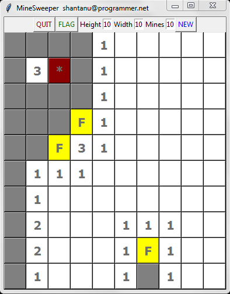

# MineSweeper :bomb:
>Basic Minesweeper game written in python
> * tkinter GUI package is used



## Instructions
* **directly execute:** :black_large_square: 
  ```
  >python minsweeper.py
  ```
* **generate standalone executable for windows:**
  ```
  >python setup.py install
  >python setup.py py2exe
  
  ```
  
### Notes
* Added variable number of mines to vary diffiiculty
* Added variable dimensional grid :bangbang:
